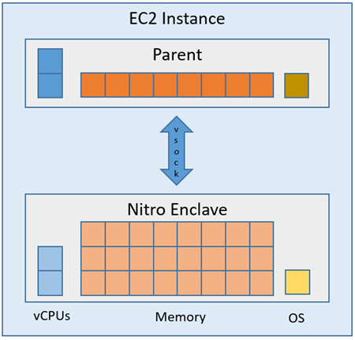
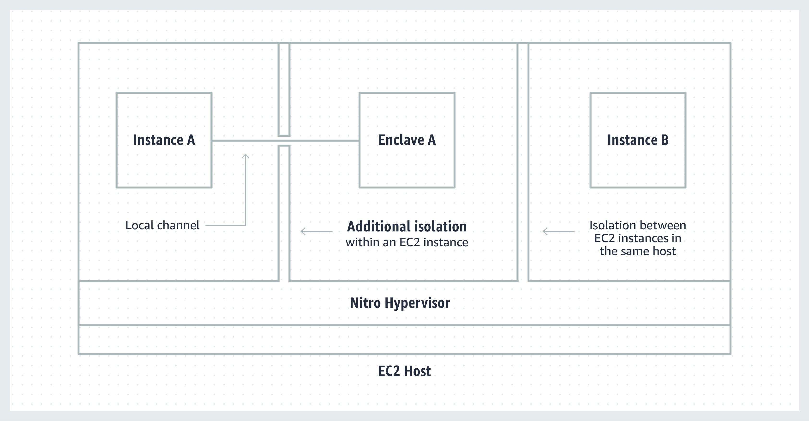

# Run Nolus Validator and a Tentermint KMS on a AWS EC2

- Status: proposal
- Deciders: business and dev team
- Date: 2022-01-05
- Tags: kms validator tendermint nitro enclave

## Context and Problem Statement
From operational and security perspective, the infrastructure where validator is deployed is of high importance. 

The main aspect of running securely a validator node is to protect its private key. The key is of `ed25519` type and is often called the Tendermint key. The setup depends on the environment validator node runs at e.g. an on-prem data center or a cloud provider.

On the other side, the protection from DoS attacks we have chosen does not stipulate where the validator nodes should run at.

The aim of this ADR is to define various options of validator deployments and KMS, assess them, and recommend one to be implemented for the validator nodes operated by the Nolus Team.

## Decision Drivers <!-- optional -->

- security
- low operational expenses

## Considered Options

- `local` - Validator in an on prem data center, Tendermint KMS + HMS either YubiHSM2 ot Ledger with Tendermint App
- `cloud` - Validator in AWS, Tendermint KMS in AWS Nitro Enclave + AWS KMS for master key decryption
- `mixed` - Validator in AWS, Tendermint KMS + HMS either YubiHSM2 ot Ledger with Tendermint App

## Decision Outcome

Chosen option: `cloud` because it combines strong security with low operational expenses. 

AWS Enclave is a protected environment running in a host EC2 with its own vCPU, memory, and OS. [Tendermin KMS](https://github.com/iqlusioninc/tmkms) is deployed in a AWS Enclave and benefits from the strong isolation of the Enclave from the host and other EC2 instances.

## Links <!-- optional -->

- [Tendermint KMS](https://github.com/iqlusioninc/tmkms)
- [Terra's Recommendation](https://docs.terra.money/How-to/Manage-a-Terra-validator/Implement-security.html#manage-digital-keys-with-hsm)
- [Desmos KMS doc](https://docs.desmos.network/next/mainnet/kms/kms/)
- [Setting up AWS Nitro Enclaves + Tendermint KMS](https://crypto.org/docs/getting-started/advanced-tmkms-integration.html#setting-up-aws-nitro-enclaves-tendermint-kms-for-signing-blocks)
- [Setting up AWS Nitro Enclaves + Tendermint KMS - Details](https://github.com/tomtau/tmkms/blob/feature/nitro-enclave/README.nitro.md)
- [Tendermint KMS + YubiHSM2 for validators](https://github.com/iqlusioninc/tmkms/blob/main/README.yubihsm.md)
- [Use of Tendermint KMS for signing transactions](https://github.com/iqlusioninc/tmkms/blob/main/README.txsigner.md)