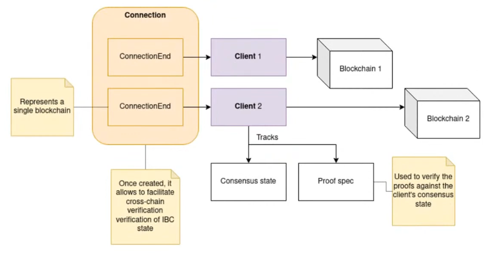
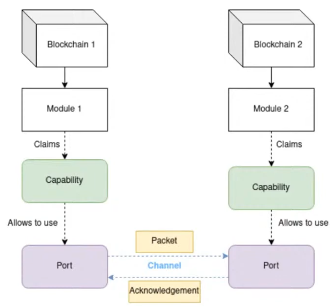
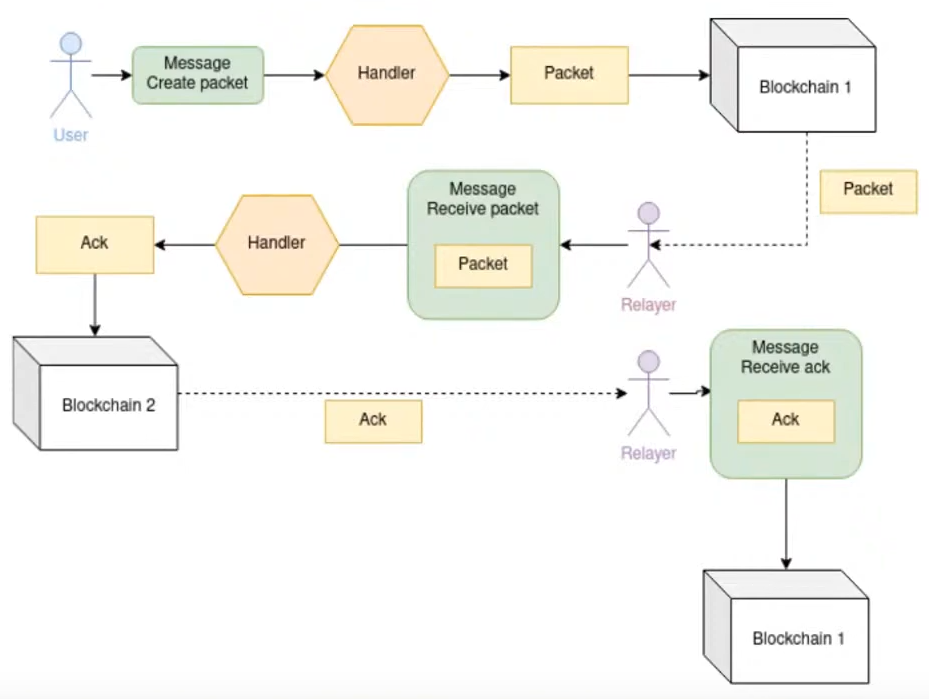

# Transactions on Cosmos SDK-based chains
Transactions on Cosmos-based chains are different than classic blockchains in the sense that they don't necessarily need to have a receiving address like in BTC or EVM-type networks.  
They are made up of a collection of message objects, which are handled by the different modules in the chain.  
For example, to send ATOMs, the user sending the transaction needs to include one or more (if sending to multiple receivers in the same transaction) `MsgSend` messages, which contain the denomination of the coin, the amount, the sender and the receiver.  
`MsgSend` resides in the `bank` module.

# IBC
The closest analogue to IBC is the TCP protocol - a module on chain A sends a packet to chain B, chain B sends an acknowledgement back to chain A upon receiving.

## Clients and connections


Clients handle the proof verification and the counter-party chain's consensus state, making sure that the packets were indeed sent from the other chain and were not fabricated.

Connections encapsulate two `ConnectionEnd` objects on both blockchains. Each `ConnectionEnd` is associated with a client of the other blockchain (the counterparty blockchain). The connection handshake is responsible for verifying that the clients on each chain are correct for their respective counterparties. Connections, once established, are responsible for facilitating all cross-chain verification of IBC state. A connection can be associated with any number of channels.

It's the relayer's responsibility to create the clients and orchestrate the connection handshake using transactions on both chains.

## Capabilities, ports, channels and packets


### Capabilities
* an IBC-enabled module must claim the capability to handle packets coming through a given port
* the capability object is returned by the Cosmos SDK, when the module calls `BindPort`
* this capability object must be passed to the Cosmos SDK when opening channels

### Ports
* analogous to IP ports
* an IBC-enabled module can bind itself to one or multiple ports
* can only be used by a single module, just like IP ports
* specified in every packet, so it can be routed to the correct module

### Channels
* a channel object is created on both chains for a specific connection, between two specific ports on both chains
* specified in every packet, so the relayer can route it to the correct destination chain
* can be used bidirectionally

## IBC packet flow


When defining a packet, a module specifies the logic for:
* creating the packet on the source chain
* receiving the packet on the destination chain
* receiving the acknowledgement on the source chain
* handling the timeout of the packet

1. The user submits a transaction to Blockchain 1 which contains a message to create the packet that needs to be sent to the other chain
2. The module handles the messages and creates and stores the packet in the chain's store
3. The relayer creates and broadcasts a transaction on Blockchain 2 which contains a message to "receive" the packet
4. The message goes through the module's handler, executes its logic and creates and stores an acknowledgement in the chain's store
5. The relayer creates and broadcasts a transaction on Blockchain 1 which contains a message to "receive" the acknowledgement
6. The module handles the message and the acknowledgement is stored in the chain's store, completing the cycle

### Timeouts
If an acknowledgement of the packet is not received on the source chain within some timeout (defined per packet), the relayer must timeout the packet, so that the appropriate logic can be executed.

For example, if a `transfer` packet timeouts, the funds that were locked when sending the packet must be refunded.

## Relayer responsibilities
To summarize, the relayer is responsible for the following:
* create the clients on both chains
* create the `ConnectionEnd` objects on both chains
* orchestrate the connection handshake
* create a channel end on both chains
* monitor for pending packets on both chains
* relay submitted packets to the counter-party chain
* monitor for packet acknowledgements
* relay packet acknowledgements back to the sending chain
* monitor for packet timeouts on both chains
* submit packet timeout transactions when a packet's has not been acknowledged past the timeout deadline
* submit "update client" transactions on both chains periodically, to update the consensus state of a chain on the opposite side

## IBC token transfers
The token transfer functionality for Cosmos-based chains is implemented and provided by the Cosmos team in their ibc-go module and is the most widely used implementation.

The token transfer is initiated with a `MsgTransfer` message, which contains the channel and port identifiers on the current chain, the amount and denomination of the coin being transferred and the receiving address on the other side.

The IBC module on the source chain creates escrow addresses for every channel, where the tokens being transferred are locked.

The IBC module on the destination chain mints a token with a denomination of `ibc/{hash}`, where `hash` is the hash of `{ics20Port}/{ics20Channel}/{denom}`, where:
* `ics20Port` - the ics-20 port of the destination chain - `transfer` by default
* `ics20Channel` - the channel identifier of the channel which the tokens were transferred through (on the destination chain) - `channel-0`, `channel-1`, etc.
* `denom` - the denomination of the coin in the source chain

When transfering the newly minted tokens to the original chain, the IBC module on the source chain burns the tokens, while the IBC module on the destination chain unescrows the original tokens and transfers them to the receiver.

Example:
1. We send `1000nomo` from some address NA in the nomo blockchain to some address CA in the cosmos hub
2. CA now has `1000ibc/347962DC88B3831F0FECB94E0A021B702B0AD0F6268200C84AADC43A6E37EC5C`
3. We send `1000ibc/347962DC88B3831F0FECB94E0A021B702B0AD0F6268200C84AADC43A6E37EC5C` from CA to some address NB
4. NB now has `1000nomo`

When transfering tokens through multiple different chains, the denomination of the minted tokens keep track of the tokens path between them.
For example, if transfering a token through A -> B -> C, the resulting denomination of the token in chain C would be `ibc/{portOnC}/{channelOnC}/ibc/{portOnB}/{channelOnB}/{denomOnA}`. In this case, to receive the original tokens on A, we would need to travel the same path backwards, i.e. C -> B -> A.  
Sending the token from C -> A, would result in a new denomination - `ibc/{portOnA}/{channelOnA}/ibc/{portOnC}/{channelOnC}/ibc/{portOnB}/{channelOnB}/{denomOnA}`.

## IBC relayer incentives
The Cosmos team have defined a specification for networks that want to add support for relayer fees and incentives - [ICS-29](https://github.com/cosmos/ibc/tree/master/spec/app/ics-029-fee-payment) and [ICS-30](https://github.com/cosmos/ibc/tree/master/spec/app/ics-030-middleware).  
ICS-30 defines a new type of middleware module, which sits between the core IBC and the underlying application. It's meant to be self-contained and to implement its own application-specific logic through a set of interfaces with the core IBC handlers. ICS-29 is defined as a middleware module and is being implemented by the Cosmos team in the ibc-go package.  
According to the specification:
* relayer fees will be payed by the user submitting the IBC packet on the source chain in the same transaction as a separate message
* there will be separate fees for relaying the packet, relaying the acknowledgement and the packet timeout
* relayers may specify the token denominations of the fees they expect
* as an example, they may specify a relay fee in the "wrapped" IBC native token, transferred from the destination chain; this way they can transfer these tokens back to the destination chain to keep their balance topped up automatically

The Cosmos team is targeting to release their ICS-29 implementation either at the end of Q4 2021 or the beginning of Q1 2022.

# registry.yaml for ts-relayer
```yaml
version: 1

chains:
  localtestnet:
    chain_id: nomo-private
    prefix: nomo
    gas_price: 0nomo
    # this defines the gas limits we are going to use
    gas_limits:
      # max amount of gas to be used when performing client init transactions
      init_client: 150000
      # # max amount of gas to be used when performing client update transactions
      update_client:
        600000
        # max amount of gas to be used when performing connection init transactions
      init_connection:
        150000
        # max amount of gas to be used when performing connection handshakes transactions
      connection_handshake:
        300000
        # max amount of gas to be used when performing channel init transactions
      init_channel:
        150000
        # max amount of gas to be used when performing channel handshakes transactions
      channel_handshake:
        500000
        # max amount of gas to be used when receiving packets
      receive_packet:
        500000
        # max amount of gas to be used when receiving acknowledgments
      ack_packet:
        500000
        # max amount of gas to be used when receiving timeout packets
      timeout_packet:
        500000
        # max amount of gas to be used when performing transfer transactions
      transfer: 180000
    # Default keyring hd_path for the SDK
    # This is used for example by `gaiad keys` and most CosmJS webapps
    # Set this if you want to share the relayer account with a CLI account (not recommended)
    hd_path: m/44'/118'/0'/0/0
    ics20_port: 'transfer'
    rpc:
      - http://localhost:26657
  cosmoshub-testnet:
    chain_id: cosmoshub-testnet
    prefix: cosmos
    gas_price: 0uphoton
    # this defines the gas limits we are going to use
    gas_limits:
      # max amount of gas to be used when performing client init transactions
      init_client: 150000
      # # max amount of gas to be used when performing client update transactions
      update_client:
        600000
        # max amount of gas to be used when performing connection init transactions
      init_connection:
        150000
        # max amount of gas to be used when performing connection handshakes transactions
      connection_handshake:
        300000
        # max amount of gas to be used when performing channel init transactions
      init_channel:
        150000
        # max amount of gas to be used when performing channel handshakes transactions
      channel_handshake:
        500000
        # max amount of gas to be used when receiving packets
      receive_packet:
        500000
        # max amount of gas to be used when receiving acknowledgments
      ack_packet:
        500000
        # max amount of gas to be used when receiving timeout packets
      timeout_packet:
        500000
        # max amount of gas to be used when performing transfer transactions
      transfer: 180000
    # Default keyring hd_path for the SDK
    # This is used for example by `gaiad keys` and most CosmJS webapps
    # Set this if you want to share the relayer account with a CLI account (not recommended)
    hd_path: m/44'/118'/0'/0/0
    ics20_port: 'transfer'
    rpc:
      - https://rpc.testnet.cosmos.network:443
```

# Network upgrades
All IBC channels, connections and clients are preserved when upgrading the network, so long as the chain's state is kept intact during the upgrade.

However, changing the chain ID of the network, the `UnbondingPeriod` or any of the changes listed [here](https://github.com/cosmos/ibc-go/blob/main/docs/ibc/upgrades/quick-guide.md#ibc-client-breaking-upgrades), results in broken clients in all connected chains. This requires a [client upgrade proposal](https://github.com/cosmos/ibc-go/blob/main/docs/ibc/proto-docs.md#upgradeproposal) to be submitted, which will produce an upgraded client and consensus states, which relayers must propagate to the connected chains for the connections to continue functioning. Full steps listed [here](https://github.com/cosmos/ibc-go/blob/main/docs/ibc/upgrades/quick-guide.md#step-by-step-upgrade-process-for-sdk-chains).  
Even though we have this proposal disabled, in case we need to create a hard fork we will:
1. Perform a soft fork upgrade enabling the proposal
2. Submit a client upgrade proposal
3. Perform the hard fork upgrade, disabling the proposal once again

During an `ibc-go` upgrade, there might be changes or migrations that we need to run in our new node binary. These are documented in the docs directory of the ibc-go repository.  
Example: https://github.com/cosmos/ibc-go/blob/main/docs/migrations/ibc-migration-043.md

## Soft fork
If no client-breaking changes were made, then no steps need to be taken regarding IBC channels, connections or clients on the other side of the IBC connections.

## Genesis restarts without any client-breaking changes
Genesis restarts can break relays if the clients on the connected chains are not updated with the last block header before the restart. See https://github.com/informalsystems/ibc-rs/issues/1152.

There are two approaches in avoiding IBC client breakage after a genesis restart.

### 1. Pause the network before the upgrade and wait for the clients to be updated by the relays
When performing a genesis restart upgrade, all clients on the opposite sides of the IBC connections must be updated with the block header of the last block before the restart. Relay operators should be notified that they must perform this client update, or else their relays will stop working, as this upgrade path is not supported by the relay implementations as of writing this doc.

### 2. Export from the earliest block height that is used by a client on a connected chain
This approach involves identifying which block height the oldest client on a connected chain uses and exporting the new genesis block from that height.

# Links
https://www.youtube.com/watch?v=816PP8oXv0Q - IBC high level overview + hello world IBC module  
https://github.com/cosmos/ibc-go/blob/main/modules/core/spec/01_concepts.md - IBC connections, channels, ports, etc.  
https://github.com/cosmos/ibc/tree/master/spec/app/ics-020-fungible-token-transfer - IBC token transfer specification
https://github.com/cosmos/ibc-go/blob/main/modules/apps/transfer/spec/01_concepts.md - ibc-go notes on handling multihop tokens
https://github.com/confio/ts-relayer - Relayer implementation in TypeScript